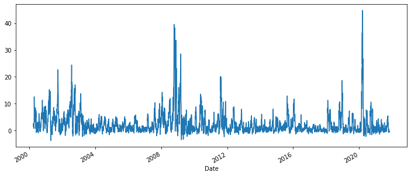
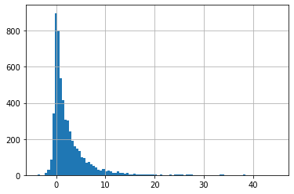

# Anomaly Detection with Salesforce Merlion Package - Unsupervised anomaly detection

## Reference:
- github: https://github.com/salesforce/Merlion

## Notes on installing Merlion:

- according to the github page,using `pip install salesforce-merlion` should be sufficient to have the Merlion package installed. 
- however, on Windows machine, an error can occur due to Merlion's dependency package `fbprophet`. 
- in order to have merlion package be installed successfully, we need to first install `fbprophet` package. This [stack overflow](https://stackoverflow.com/questions/53178281/installing-fbprophet-python-on-windows-10) page provides useful tricks to fix issues with installing `fbprophet` package on Windows machine.
- what did not work for me: first run `pip install pystan==2.18.0.0`, then run `pip install fbprophet`. 
- what worked for me: 
   - first run `pip install pystan==2.17.1.0`. This step will uninstall whatever version of pystan package on the machine and isntall the version specified in the pip command.
   - then run `pip install fbprophet`. This step will retrieve the latest pystan version, uninstall the version installed from previous step and install the latest version. The successfuly installation message `Successfully installed cmdstanpy-0.9.68 prophet-1.0.1 pystan-2.19.1.1`.
   
   
## Steps
- reference: [example](https://github.com/salesforce/Merlion/blob/main/examples/anomaly/1_AnomalyFeatures.ipynb)
- Isolation Forest: [sklearn](https://scikit-learn.org/stable/modules/generated/sklearn.ensemble.IsolationForest.html)

1. download market data using yfinance: download S&P 500 ('^GSPC')
1. calculate return 20 day max return (i.e. target in supervised learning problem):
   - for each date (T):
      - calculate the max price change in next 20 trading dates: price_change = (max{close price in T+1 to T+20} - {close price on T})/({close price on T})
1. use Merlion to do unsupervised anomaly detection
    1. Initializing an anomaly detection model (including ensembles)
    1. Training the model
    1. Producing a series of anomaly scores with the model


```python
import numpy as np
import pandas as pd
import statsmodels.api as sm

from datetime import datetime, timedelta
import yfinance as yf #to download stock price data
```


```python
import matplotlib.pyplot as plt

from merlion.plot import plot_anoms
from merlion.utils import TimeSeries
```


```python
np.random.seed(5678)
```

#### download S&P 500 price data


```python
ticker = '^GSPC'
cur_data = yf.Ticker(ticker)
hist = cur_data.history(period="max")
print(ticker, hist.shape, hist.index.min())
```

    ^GSPC (19720, 7) 1927-12-30 00:00:00 
    


```python
df=hist[hist.index>='2000-01-01'].copy(deep=True)
df.head()
```


<div>
<style scoped>
    .dataframe tbody tr th:only-of-type {
        vertical-align: middle;
    }

    .dataframe tbody tr th {
        vertical-align: top;
    }

    .dataframe thead th {
        text-align: right;
    }
</style>
<table border="1" class="dataframe">
  <thead>
    <tr style="text-align: right;">
      <th></th>
      <th>Open</th>
      <th>High</th>
      <th>Low</th>
      <th>Close</th>
      <th>Volume</th>
      <th>Dividends</th>
      <th>Stock Splits</th>
    </tr>
    <tr>
      <th>Date</th>
      <th></th>
      <th></th>
      <th></th>
      <th></th>
      <th></th>
      <th></th>
      <th></th>
    </tr>
  </thead>
  <tbody>
    <tr>
      <th>2000-01-03</th>
      <td>1469.250000</td>
      <td>1478.000000</td>
      <td>1438.359985</td>
      <td>1455.219971</td>
      <td>931800000</td>
      <td>0</td>
      <td>0</td>
    </tr>
    <tr>
      <th>2000-01-04</th>
      <td>1455.219971</td>
      <td>1455.219971</td>
      <td>1397.430054</td>
      <td>1399.420044</td>
      <td>1009000000</td>
      <td>0</td>
      <td>0</td>
    </tr>
    <tr>
      <th>2000-01-05</th>
      <td>1399.420044</td>
      <td>1413.270020</td>
      <td>1377.680054</td>
      <td>1402.109985</td>
      <td>1085500000</td>
      <td>0</td>
      <td>0</td>
    </tr>
    <tr>
      <th>2000-01-06</th>
      <td>1402.109985</td>
      <td>1411.900024</td>
      <td>1392.099976</td>
      <td>1403.449951</td>
      <td>1092300000</td>
      <td>0</td>
      <td>0</td>
    </tr>
    <tr>
      <th>2000-01-07</th>
      <td>1403.449951</td>
      <td>1441.469971</td>
      <td>1400.729980</td>
      <td>1441.469971</td>
      <td>1225200000</td>
      <td>0</td>
      <td>0</td>
    </tr>
  </tbody>
</table>
</div>


#### calcualte max return in next 20 trading days


```python
#for each stock_id, get the max close in next 20 trading days
price_col = 'Close'
roll_len=20
new_col = 'next_20day_max'
target_list = []

df.sort_index(ascending=True, inplace=True)
df.head(3)
```


<div>
<style scoped>
    .dataframe tbody tr th:only-of-type {
        vertical-align: middle;
    }

    .dataframe tbody tr th {
        vertical-align: top;
    }

    .dataframe thead th {
        text-align: right;
    }
</style>
<table border="1" class="dataframe">
  <thead>
    <tr style="text-align: right;">
      <th></th>
      <th>Open</th>
      <th>High</th>
      <th>Low</th>
      <th>Close</th>
      <th>Volume</th>
      <th>Dividends</th>
      <th>Stock Splits</th>
    </tr>
    <tr>
      <th>Date</th>
      <th></th>
      <th></th>
      <th></th>
      <th></th>
      <th></th>
      <th></th>
      <th></th>
    </tr>
  </thead>
  <tbody>
    <tr>
      <th>2000-01-03</th>
      <td>1469.250000</td>
      <td>1478.000000</td>
      <td>1438.359985</td>
      <td>1455.219971</td>
      <td>931800000</td>
      <td>0</td>
      <td>0</td>
    </tr>
    <tr>
      <th>2000-01-04</th>
      <td>1455.219971</td>
      <td>1455.219971</td>
      <td>1397.430054</td>
      <td>1399.420044</td>
      <td>1009000000</td>
      <td>0</td>
      <td>0</td>
    </tr>
    <tr>
      <th>2000-01-05</th>
      <td>1399.420044</td>
      <td>1413.270020</td>
      <td>1377.680054</td>
      <td>1402.109985</td>
      <td>1085500000</td>
      <td>0</td>
      <td>0</td>
    </tr>
  </tbody>
</table>
</div>


```python
df_next20dmax=df[[price_col]].shift(1).rolling(roll_len).max()
df_next20dmax.columns=[new_col]
df = df.merge(df_next20dmax, right_index=True, left_index=True, how='inner')

df.dropna(how='any', inplace=True)
df['target']= 100*(df[new_col]-df[price_col])/df[price_col]  
```


```python
df.head(3)
```


<div>
<style scoped>
    .dataframe tbody tr th:only-of-type {
        vertical-align: middle;
    }

    .dataframe tbody tr th {
        vertical-align: top;
    }

    .dataframe thead th {
        text-align: right;
    }
</style>
<table border="1" class="dataframe">
  <thead>
    <tr style="text-align: right;">
      <th></th>
      <th>Open</th>
      <th>High</th>
      <th>Low</th>
      <th>Close</th>
      <th>Volume</th>
      <th>Dividends</th>
      <th>Stock Splits</th>
      <th>next_20day_max_x</th>
      <th>target</th>
      <th>next_20day_max_y</th>
      <th>next_20day_max</th>
    </tr>
    <tr>
      <th>Date</th>
      <th></th>
      <th></th>
      <th></th>
      <th></th>
      <th></th>
      <th></th>
      <th></th>
      <th></th>
      <th></th>
      <th></th>
      <th></th>
    </tr>
  </thead>
  <tbody>
    <tr>
      <th>2000-03-29</th>
      <td>1507.729980</td>
      <td>1521.449951</td>
      <td>1497.449951</td>
      <td>1508.520020</td>
      <td>1061900000</td>
      <td>0</td>
      <td>0</td>
      <td>1527.459961</td>
      <td>1.255531</td>
      <td>1527.459961</td>
      <td>1527.459961</td>
    </tr>
    <tr>
      <th>2000-03-30</th>
      <td>1508.520020</td>
      <td>1517.380005</td>
      <td>1474.630005</td>
      <td>1487.920044</td>
      <td>1193400000</td>
      <td>0</td>
      <td>0</td>
      <td>1527.459961</td>
      <td>2.657395</td>
      <td>1527.459961</td>
      <td>1527.459961</td>
    </tr>
    <tr>
      <th>2000-03-31</th>
      <td>1487.920044</td>
      <td>1519.810059</td>
      <td>1484.380005</td>
      <td>1498.579956</td>
      <td>1227400000</td>
      <td>0</td>
      <td>0</td>
      <td>1527.459961</td>
      <td>1.927158</td>
      <td>1527.459961</td>
      <td>1527.459961</td>
    </tr>
  </tbody>
</table>
</div>


```python
df['target'].plot.line(figsize=(12,5))
```


    <AxesSubplot:xlabel='Date'>


    

    


```python
df['target'].hist(bins=100)
```


    <AxesSubplot:>


    

    


#### Merlion: Anomaly detection - unsupervised with Isolation Forest 


```python
train_data = TimeSeries.from_pd(df[['target']].iloc[:-200])
test_data = TimeSeries.from_pd(df[['target']].iloc[-200:])
```


```python
# Import models & configs
from merlion.models.anomaly.isolation_forest import IsolationForest, IsolationForestConfig


# isolation forest
iso_forest_config = IsolationForestConfig()
iso_forest_model  = IsolationForest(iso_forest_config)
```


```python
iso_forest_train_score = iso_forest_model.train(train_data=train_data, anomaly_labels=None)
```


```python
iso_forest_train_score.to_pd().plot.line(figsize=(12,5))
```


    <AxesSubplot:>


    

    


- Model Inference
   - model.get_anomaly_score() returns the model's raw anomaly scores,  
   - model.get_anomaly_label() returns the model's post-processed anomaly scores. The post-processing calibrates the anomaly scores to be interpretable as z-scores, and it also sparsifies them such that any nonzero values should be treated as an alert that a particular timestamp is anomalous.


```python
test_scores = iso_forest_model.get_anomaly_score(test_data)
test_scores_df = test_scores.to_pd()

test_labels = iso_forest_model.get_anomaly_label(test_data)
test_labels_df = test_labels.to_pd()
```


```python
test_scores_df.plot.line(figsize=(12,5))
```


    <AxesSubplot:>


    

    


```python
test_labels_df.value_counts()
```


    anom_score
    0.0           199
    dtype: int64


