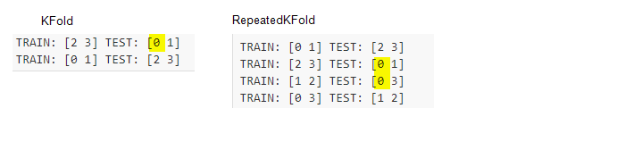
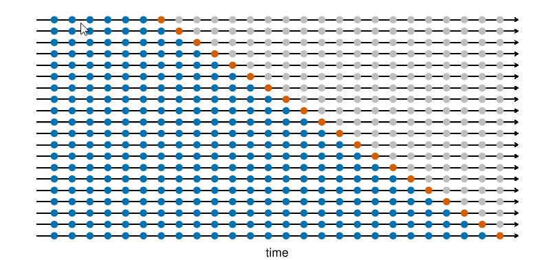
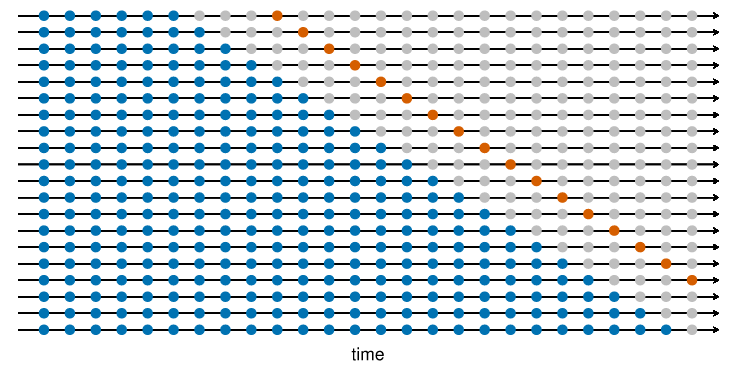

***
### Time series data split for cross validation
*Nov 10, 2021*

Cross-validation is a resampling method that uses different portions of the data to test and train a model on different iterations.  The goal of cross-validation is to test the model's ability to predict on unseen dataset and address issues like overfitting or selection bias. [source: Wikepedia](https://en.wikipedia.org/wiki/Cross-validation_(statistics)){:target="_blank"}

There are a number of ways to split and iterate through training dataset, and k-fold and its variations are most commonly used. 

- k-fold: implemented in scikit-learn KFold: 
   - In a typical k-fold setup for non-time series data, data is first split into training data and testing data. the training dataset is then split into k folds (i.e. k subset) with k typically at 5. The hyperparameter tuning process is run on the k-fold data and oof (out of fold) performance is used to select the best set or top few best sets of hyperparameters. The whole training data set will then be fitted into the selected hyperparameters to create models that will make predictions on testing dataset. The performance on testing data will be used to determine which models be deployed for production.
       - {:height="50%" width="50%"}
       - {:height="60%" width="60%"}
		- [source: scikit-learn](https://scikit-learn.org/stable/modules/cross_validation.html){:target="_blank"} 
   
- Variations of k-fold: implemented in scikit-learn KFold, RepeatedKFold, StratifiedKFold, RepeatedStratifiedKFold:
   - A few variations of the simple k-fold such as RepeatedKFold and StratifiedKFold are also implemented in scikit-learn.
   - in KFold, each observation will be in test fold once; in RepeatedKFold, each observation can be in test fold several times
   - in StratifiedKFold: the folds are made by preserving the percentage of samples for each class, each observation will be in test fold only once; RepeatedStratifiedKFold: the folds are made by preserving the percentage of samples for each class, each observation can be in test fold several times.
   - 
   
- However, the traditional k-fold approach may not be the correct approach for time series data due to the innate causal relationship and serial correlation within time series data. Directly applying the k-fold on time series data may lead to: 
   - input feature information leakage. The information leakage may come from two areas: first, the serial correlation (i.e. autocorrelation) in data; second, if technical features such as 20 day moving average are created, then later observations will automatically have information from previous observations. In a traditional k-fold, the later period data will be used in training and earlier data in testing of the i-th fold, and since later period data includes information in earlier periods, information leak occurs.  
   - target information leakage. For example, for a target that is defined as “max return in next 20 days”, data on T+1 to T+20 will be used in order to calculate the target on day T. In a K-fold, when a later period is put in training set and earlier period is in testing data of the i-th fold, then leakage naturally occurs and OOF performance will not be representative of that on unseen data.

To address the serial correlation and innate causal relationships within time series data, two time series data split methods for cross-validation are frequently used. And these two methods are “sliding window” and “expanding window” method. Both methods make sure that models are always built using data/observations from the past and then the same model is evaluated using data/observations from the future.

-  Sliding window and Expanding window
   - this [Uber page]( https://eng.uber.com/forecasting-introduction/){:target="_blank"}provides a nice explanation of sliding and expanding window concepts.
   - 
-  Variations of sliding/expanding windows
   - In Rob J Hyndman and George Athanasopoulos book [Forecasting: Principles and Practice (3rd Edition)]( https://otexts.com/fpp3/tscv.html){:target="_blank"}, the authors showed 2 variations of expanding window. blue observations form the training sets, the orange observations form the test sets, and the gray ones are dropped.
       - expanding window without gap between training and testing data
	   - {:height="80%" width="80%"}
       - expanding window with gap between training and testing data 
	   - {:height="80%" width="80%"}
       - both variations are implemented in scikit-learn TimeSeriesSplit (in version 0.24)
-  In article Guo C-Y article [“A novel cross-validation strategy for artificial neural networks using distributed-lag environmental factors”](https://journals.plos.org/plosone/article?id=10.1371/journal.pone.0244094){:target="_blank"}, the authors mentioned 3 time series data split methods:
   - 5-fold cross validation: this method was detailed in article [Bergmeir C, Hyndman RJ, Koo B. A note on the validity of cross-validation for evaluating autoregressive time series prediction. Computational Statistics & Data Analysis. 2018;120:70–83.](https://mineracaodedados.files.wordpress.com/2017/07/cv-wp.pdf)
   - 
   - Leave-One-Block-Out Cross-Validation (LOBO-CV): LOBO-CV utilizes all distributed-lag time series since part of the training set occurred before the testing set. This is the similar to traditional k-fold setup, except that here requires testing fold  data to be in consecutive dates while the k-fold does not have such a constraint. 
   - Temporal-Block Cross-Validation (TB-CV). TB-CV is based on LOBO-CV but avoids unreasonable predictions using the later data. Hence, the sample size of TB-CV is significantly reduced compared to LOBO-CV, especially in the first sequential block. This is the expanding window setup
   - {:height="50%" width="50%"}

In practice – specifically in Kaggle competitions – both the k-fold and time series sliding/expanding windows are used on time series data. And many top performing competitors claimed that they used k-fold instead of time series approach for the cross validation. 

In my own experience, due the fact that the statistical properties of a time series can vary with time – often referred as temporal covariate shift or regime shift, the expanding/sliding window does not help produce models outperform in testing data. 

	   
